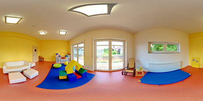
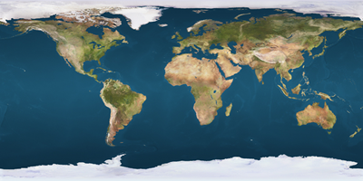

<html lang="ja">
    <head>
        <meta charset="utf-8" />
    </head>
    <body>
        <h1>
Panorama
</h1>
        <h2>なにものか？</h2>
        

            画像を球面にテクスチャーマップするだけのアプリケーションです。 
            panorama：視点が球の内部　sphere：視点が球の外
        

        <h3>Panorama</h3>
        

             
            
        

        <h3>Sphere</h3>
        

             
            
        

        <h2>環境構築方法</h2>
        

            pip install opencv-python PyOpenGL glfw 
        

        <h2>使い方</h2>
        

            python panorama.py (画像ファイル) 
             
            python sphere.py (画像ファイル) 
             
            <table border="1">
                <tr><th>操作</th><th>機能</th></tr>
                <tr><td>左ボタン押下＋ドラッグ</td><td>3Dモデルの回転(yaw,pitch)</td></tr>
                <tr><td>rキー押下＋ホイール回転</td><td>3Dモデルの回転(roll)</td></tr>
                <tr><td>右ボタン押下＋ドラッグ</td><td>3Dモデルの移動</td></tr>
                <tr><td>ホイール回転</td><td>3Dモデルの拡大・縮小</td></tr>
                <tr><td>hキー押下＋ホイール回転</td><td>水平方向のテクスチャー貼り付け角度増減</td></tr>
                <tr><td>vキー押下＋ホイール回転</td><td>垂直方向のテクスチャー貼り付け角度増減</td></tr>
                <tr><td>ホイールボタン押下</td><td>慣性モードのトグル(on⇔off)</td></tr>
                <tr><td>iキー押下</td><td>(同上)</td></tr>
                <tr><td>sキー押下</td><td>スクリーンショット保存</td></tr>
                <tr><td>ウィンドウ閉じるボタン押下　</td><td>プログラム終了</td></tr>
            </table>
        

    </body>
